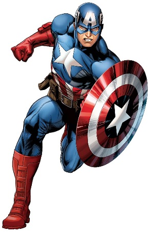

Captain America
===============

+-----------------+----------------------------------------+
| Alter Ego       |  *Steve Rogers*                        |
+-----------------+----------------------------------------+
| Abilities       | - Super Solider Serum                  |
|                 | - Enhanced strength, endurance, speed, |
|                 |   relfexes, and endurance              |
|                 | - Expert tactician and field commander |
|                 | - Wields an impenetrable shield        |
+-----------------+----------------------------------------+
| Arch-Nemesis    | `Red Skull`_                           |
+-----------------+----------------------------------------+
| Popular Enemies | - Winter Solider                       |
|                 | - Hydra                                |
|                 | - Taskmaster                           |
|                 | - Neo-Nazies                           |
+-----------------+----------------------------------------+

.. _Red Skull: ../villains/red_skull.html

**Backstory:**
Steve Rogers was a scrawny teenager during the Great Depression. After both of his parents died from natural causes, World War II began. After Steve Rogers saw the atrocities of the Nazis, he tried to enlist into the army. However, he didn’t pass the physical requirements to be in the army. The army noticed Steve Rogers bravery and potential and enlisted him in their experimental Super-Solider program. Steve took the serum and was exposed to Vita-Rays to help stabilize the serum inside of him. He grew out of his scrawny state and became a super-human. The serum maximized the efficiency of the human body and granted him strength and stamina.  

Captain America's first task was to stop the Nazi leader, Red Skull, and to become a symbolic symbol for the country. After succeeding his symbolic task, Rogers went through a mind-conditioning program. He trained to start using a fake identity and a fake background, in the chance if he was captured.  During a mission in Africa, Rogers traveled to Wakanda and befriended the leader T'chaka. From there, he obtained an extremely rare and impossible to duplicate vibranium metal shield. 

When World War II was coming to an end, Rogers and his friend, Bucky, confronted the Red Skull for the last time. Finding out about a plan to bomb the United States, Rogers and Bucky got onto the bomb-plane at the last minute. Rogers attempted to disable the bomb but it exploded mid-air, sending Bucky and Rogers into the artic. Both survived the crash, but Bucky was captured by Soviets and Rogers remained in a frozen state. Captain America was discovered by the Avengers and woke up from his frozen state. Captain America joined the Avengers shortly after coming to the terms of finding out everyone he knew is now gone. 