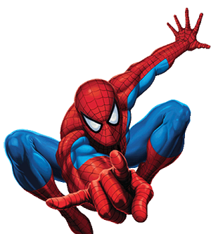

Spider-Man
==========

+--------------+----------------------------------------------+
| Alter Ego    |  Peter Benjamin Parker                       |
+--------------+----------------------------------------------+
| Abilities    | - Genius level intellect and proficient      |
|              |  scientist/inventor                          |
|              | - Superhuman strength, speed, durability,    |
|              |  and agility                                 |
|              | - Ability to cling to almost any surface     |   
|              | - Spider-sense                               | 
|              | - Possesses web-shooters containing man-made |
|              |   silk material                              |
+--------------+----------------------------------------------+
| Arch-Nemesis | `Green Goblin`_                              |
+--------------+----------------------------------------------+
| Popular      | - Venom                                      |
| Villains     | - Doctor Octopus                             |
|              | - Rhino                                      |
|              | - Carnage                                    |
|              | - Sandman                                    |
|              | - Kingpin                                    |
|              | - Mysterio                                   |
+--------------+----------------------------------------------+

.. _Green Goblin: ../villains/green_goblin.html

**Backstory:**

Peter Parker was born and raised in New York City by his Aunt May and Uncle Ben, because his parents, Richard and Mary Parker, died in a plane crash. Parker was your typical geek in school, as he was incredibly gifted in science, but fell short on the social spectrum. Peter spent most of his young life being bullied and made fun of in school due to his dorky, short, and weak appearance.
    
Attending a public science exhibit when he was 15, Peter was bitten on the hand by a spider that had accidentally gotten in the way of a particle beam. Within the following 24 hours, peter noticed an extreme spike in his strength, energy, and agility, as well as having incredibly sticky palms and soles of his feet. He also gained an incredible ability to sense impending danger before it happens. Feeling this new power in him, Peter decided to put these powers to the test on a local wrestling show against the superstar wrestler, Crusher Hogan. Becoming an overnight sensation, Peter decided to use his powers only for his benefit, as well as the benefit of Uncle Ben and Aunt May.

One fateful night, Peter encountered a bank robbery. Ultimately not stopping the perpetrator’s escape, Peter would soon regret this decision. Later that night, Peter learns that the same burglar fatally wounded his beloved Uncle Ben in an encounter further down the street. Finally encountering the burglar later that week, Parker finally got his vengeance on the murderous thief. Ever since that day, Parker decided to use his powers for the good of all people in New York City.

To support his Aunt May, Peter took a freelance job as a photographer for the Daily Bugle. He used his Spider-Man alias to his benefit by selling pictures to the publisher, J. Jonah Jameson, for some extra cash, as the crazed Jameson believes Spider-Man to be a scoundrel. Along with photography, Parker spends a lot of time researching with his long-time friend Harry Osborn’s father, Norman Osborn.

