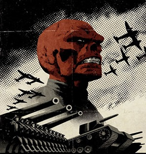

Red Skull
=========

+------------------+----------------------------------------+
| Alter Ego        | *Johann Scmidt*                        |
+------------------+----------------------------------------+
| Abilities        | - Super Soldier Serum                  |
|                  | - Enhanced strength, speed, agility,   |
|                  |   reflexes, stamina, durability, and   |
|                  |   mental tactics                       |
+------------------+----------------------------------------+
| Arch-Nemisis     | `Captain America`_                     |
+------------------+----------------------------------------+

.. _Captain America: ../heroes/captain_america.html

**Background:**
Johann Shmidt was raised and abused as an orphan in Germany, before the rise of Nazism. As a teenager, Johann joined the Third Reich and became a bellhop for one of their major hotels. By chance, Johann was in the presence of Hitler when he fired an officer, and swore he could train a better Nazi out of a simple bell hoper. Hitler recruited Johann and sent him to train at a camp.

Unhappy with the results of Johann, Hitler pulled him from camp and trained him personally. Completing Hitler’s training, Johann took up the role of being the embodiment of Nazi terrorism. He was given a uniform with a red skull mask and become the Red Skull. Leading terrorist activities of Nazi Germany, the Red Skull was very successful during the early part of WWII. The task of the Red Skull was to be the embodiment of Nazi Germany. Johann was so successful at this task, the United States noticed the effect of his propaganda. The United States countered this by creating a counterpart of the Red Skull, known as Captain America. The Red Skull met his demise during a battle with Captain America. He found himself buried under a destroyed building. This building contained a gas which would keep the Red Skull in a suspended animation for many years.